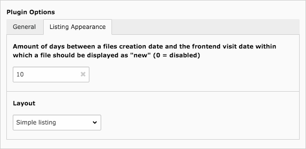

.. ==================================================
.. FOR YOUR INFORMATION
.. --------------------------------------------------
.. -*- coding: utf-8 -*- with BOM.

.. include:: ../../Includes.txt

.. _developer-manual-flexform:

Extend FlexForm
---------------

Following fields of the plugin configuration may be extended without overriding the complete FlexForm configuration.

.. only:: html

	.. contents::
		:local:
		:depth: 1

.. _developer-manual-flexform-templateLayouts

Additional Template Layouts
^^^^^^^^^^^^^^^^^^^^^^^^^^^

By default this extension provides two different "layouts" available in a drop-down list:

If you need other options, you may register them easily using following code:

.. code-block:: php

    $GLOBALS['TYPO3_CONF_VARS']['EXT']['file_list']['templateLayouts'][] = [
        'my label',
        'my value'
    ];

You can then access the variable in your template with ``{settings.templateLayout}`` and use it for a condition or
whatever.
