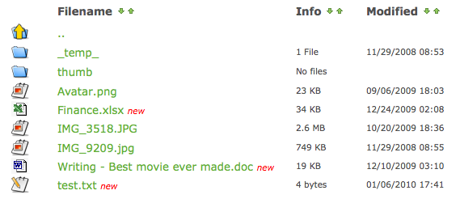
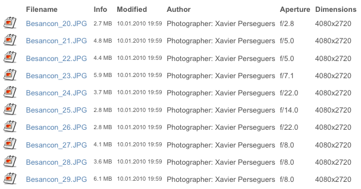
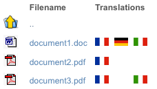

.. ==================================================
.. FOR YOUR INFORMATION
.. --------------------------------------------------
.. -*- coding: utf-8 -*- with BOM.

.. include:: ../Includes.txt

.. _introduction:

Introduction
============

.. _what-it-does:

What does it do?
----------------

This extension provides a frontend plugin which shows a list of files and folders in a specified directory on the file
system or using more advanced FAL selectors such as categories or collections of files.

You can sort the files in this directory over the Backend by name, size or creation date. Also Frontend users may, if
you want, sort over the list (legacy plugin only). The files will be sorted by name by default.

There is also an option to display files as "new" (with a localized text after the name).

.. hint::
    As you may figure it out, this plugin could easily turn a list of images (and possibly subfolders) into an
    easy-to-use image gallery. You probably will not be in need of any other extension for that purpose.

    Be sure to have a look and consider installing extension "image_autoresize"
    `available in TER <https://typo3.org/extensions/repository/view/image_autoresize>`__ if you plan to seriously use
    TYPO3 for storing a large collection of images.

.. note::
    Default templates are using (light) Bootstrap markup.

.. _screenshots:

Screenshots
-----------

Information such as titles and descriptions are those you may populate in TYPO3 Backend, using FAL.

.. _screenshots-simple:

Simple list
^^^^^^^^^^^

.. image:: ../Images/list-simple.png
    :alt: Simple list

.. _screenshots-simple:

Breadcrumb menu
^^^^^^^^^^^^^^^

A breadcrumb menu lets you easily go back to higher directories when browsing a deep directory structure.

.. image:: ../Images/list-breadcrumb.png
    :alt: Breadcrumb menu

.. _screenshots-description-thumbnail:

Description and thumbnail
^^^^^^^^^^^^^^^^^^^^^^^^^

.. image:: ../Images/list-description-thumbnail.png
    :alt: List with description and thumbnail

.. hint::
    You may use extension "extractor" `available in TER <https://typo3.org/extensions/repository/view/extractor>`__ to
    automatically extract and populate metadata when you upload assets to your website.

.. _screenshots-legacy:

Legacy plugin
^^^^^^^^^^^^^

Here are a few screenshots using the legacy plugin (which only supports local storages with FAL and is using a
marker-based template instead of Fluid).

.. caution::
    You are encouraged to update your website and use the new plugin instead of the old one. The legacy plugin is not
    maintained anymore and will be dropped altogether in a future release of this extension.

You want to show additional columns of information? Use one of the hook (:file:`Resources/Private/Samples/metadata/`):

You may even transform your list of pictures into a small photo gallery that provides lightbox click-enlarge feature,
again with a hook (:file:`Resources/Private/Samples/gallery/`):

Another example would be to show a list of documents with their available translations as clickable flags, as usual with
a hook (:file:`Resources/Private/Samples/multilingual/`):

Icons
^^^^^

Icons have been created by:

- To Uyen
- Cristian Bogdan Rosu
- Erik Ragnar Eliasson
- Laurent Baumann