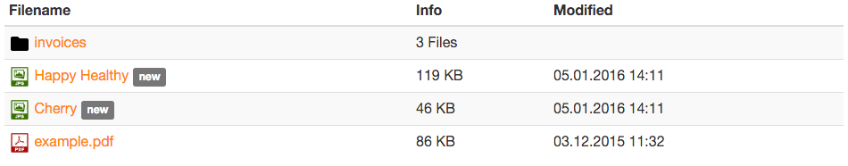
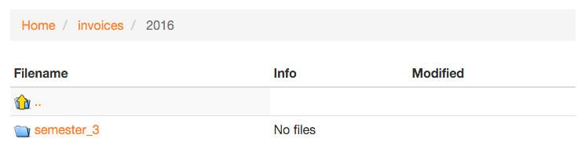
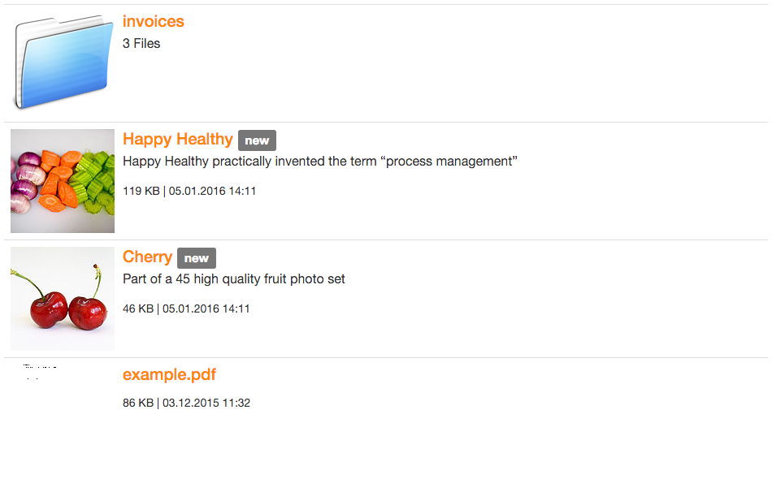

.. ==================================================
.. FOR YOUR INFORMATION
.. --------------------------------------------------
.. -*- coding: utf-8 -*- with BOM.

.. include:: ../Includes.txt

.. _introduction:

Introduction
============

.. _what-it-does:

What does it do?
----------------

This extension provides a frontend plugin which shows a list of files and folders in a specified directory on the file
system or using more advanced FAL selectors such as categories or collections of files.

You can sort the files in this directory over the Backend by file name, title, description, size or
creation/modification date. The files will be sorted by file name by default.

There is also an option to display files as "new" (with a localized text after the name).

.. hint::
    This plugin takes file restrictions into account ("Is Visible" and "Access Groups" in the metadata of a single file)
    if you are using them.

.. hint::
    As you may figure it out, this plugin could easily turn a list of images (and possibly subfolders) into an
    easy-to-use image gallery. You probably will not be in need of any other extension for that purpose.

    Be sure to have a look and consider installing extension "image_autoresize"
    `available in TER <https://extensions.typo3.org/extension/image_autoresize>`__ if you plan to seriously use TYPO3
    for storing a large collection of images.

.. note::
    Default templates are using (light) Bootstrap markup.

.. _screenshots:

Screenshots
-----------

Information such as titles and descriptions are those you may populate in TYPO3 Backend, using FAL.

.. _screenshots-simple:

Simple list
^^^^^^^^^^^

.. _screenshots-simple:

Breadcrumb menu
^^^^^^^^^^^^^^^

A breadcrumb menu lets you easily go back to higher directories when browsing a deep directory structure.

.. _screenshots-description-thumbnail:

Description and thumbnail
^^^^^^^^^^^^^^^^^^^^^^^^^

.. hint::
    You may use extension "extractor" `available in TER <https://extensions.typo3.org/extension/extractor>`__ to
    automatically extract and populate metadata when you upload assets to your website.

Icons
^^^^^

Icons have been created by:

- To Uyen
- Cristian Bogdan Rosu
- Erik Ragnar Eliasson
- Laurent Baumann
