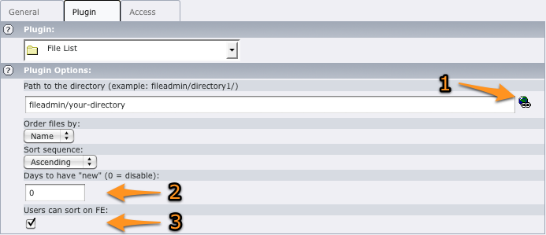

.. ==================================================
.. FOR YOUR INFORMATION
.. --------------------------------------------------
.. -*- coding: utf-8 -*- with BOM.

.. include:: ../../Includes.txt

.. _users-manual-configuration:

Configuration
-------------

.. note::
    The path will always be checked against any configured "root" (please read
    :ref:`TypoScript configuration <ts-plugin-tx-filelist-filelist-root>`), allowing the plugin to be used in a multi-site
    installation without risking an editor from showing files from another website.

.. _users-manual-configuration-legacy:

Legacy plugin
^^^^^^^^^^^^^

.. image:: ../../Images/configuration-legacy.png
    :alt: Configuration options (legacy plugin)

#. Wizard to easily select a directory

#. This allows you to show a "new" icon after the filename if the
   corresponding file has been modified within the number of days you
   specified (0 deactivates this feature)

#. The checkbox may be ticked to allow users to sort files in frontend
